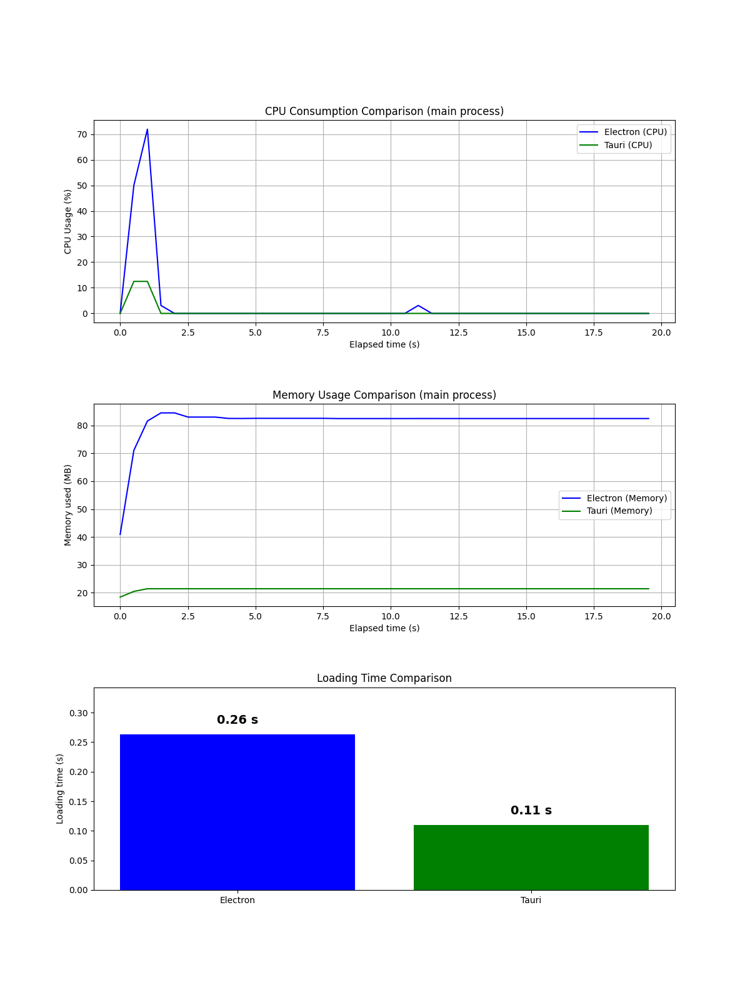
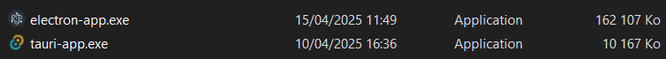
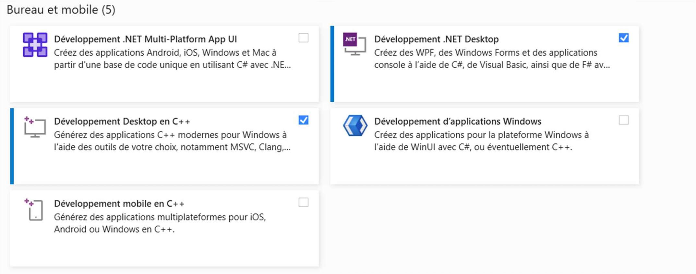

# Tauri 2.0

## Overview

Tauri 2.0 is a modern, open-source framework for building native desktop applications using web technologies (HTML, CSS, JavaScript) alongside a robust Rust-based backend. Its primary goals are:

- **Lightweight Executables**: Uses the system's native webview (like WebView2 on Windows, WKWebView on macOS, and WebKit on Linux) instead of bundling a full browser engine.
- **Enhanced Security**: Leverages Rust's memory safety guarantees and a strict command-based IPC system to minimize the attack surface.
- **High Performance**: Utilizes Rust for computationally intensive operations while keeping the UI flexible with web technologies.
- **Cross-Platform Support**: Write once and deploy on Windows, macOS, and Linux with minimal modifications.

## Technical Architecture

### Dual-Layer Design

Tauri splits the application into two major layers:

#### Frontend (UI Layer)
- **Webview-Based Rendering**: Uses the operating system's native webview component, reducing the bundle size significantly.
- **Framework Agnostic**: Supports any modern web framework (React, Vue, Svelte, Angular, etc.). The frontend consists of static assets (HTML, JS, CSS) served inside a native window.

#### Backend (Core Layer)
- **Rust-Powered**: The backend is written in Rust, known for its performance and safety. It compiles to native code, ensuring low memory overhead and high speed.
- **Secure IPC (Inter-Process Communication)**: The frontend communicates with the Rust backend via a command-based system. Only whitelisted commands can be called, significantly reducing the risk of remote code execution or unintended system access.
- **Access to Native APIs**: Through Rust, Tauri can interact with operating system APIs (file system, notifications, window management) without exposing these directly to the web layer.

### Communication
- **Command Invocation**: In your frontend JavaScript, you call Tauri's API (e.g., `window.__TAURI__.invoke('command_name', { param: value })`) to execute a function implemented in Rust.
- **JSON Messaging**: Communication is typically serialized in JSON, ensuring a simple and secure data exchange.
- **Whitelisting & Security**: The Rust backend only exposes explicitly defined functions, minimizing the surface area for potential exploits.

## Build & Packaging Process

- **Tauri CLI**: Used to scaffold, build, and package your app. It handles project initialization, development mode with live reloading, and production builds.
- **Configuration Files**: `tauri.conf.json` or `tauri.conf.rs` allow you to customize many aspects of your app, including window settings, security policies, and build options.

## Installation and Environment Setup

### Prerequisites

- **Node.js and npm**: Required to manage the frontend assets and run the Tauri CLI. Download from [nodejs.org](https://nodejs.org).
- **Rust and Cargo**: Install from [rust-lang.org](https://rust-lang.org). Use `rustup update` to keep your Rust installation current.
- **C++ Build Tools**: 
  - On Windows, install via the Visual Studio Installer (ensure you include the C++ workload).
  - On macOS and Linux, make sure you have the necessary build essentials (like Xcode command line tools on macOS).

### Installing the Tauri CLI

You can install the Tauri CLI globally using either npm or Cargo:

```bash
# Using npm
npm install -g @tauri-apps/cli

# Using cargo (Rust's package manager)
cargo install tauri-cli
```

### IDE and Developer Tools

**Visual Studio Code (VS Code)**: Install the VS Code Tauri extension for integrated Tauri commands and the rust-analyzer extension for Rust code intelligence.

## Creating and Running a Tauri App

### Setting Up a New Tauri Project

You can start from scratch using the Tauri CLI, which scaffolds the project for you:

```bash
npm create tauri-app@latest
```

During the setup, you'll be prompted to choose:
- Package Manager: (e.g., npm, yarn, or pnpm)
- Template: Choose a template such as React, Vue, or Svelte.
- Language: Option for JavaScript or TypeScript.

Once the project is created:

```bash
cd your-tauri-app
npm install
```

### Running in Development Mode

To develop your application with live reloading:

```bash
npm run tauri dev
```

This command starts both your web development server and the Tauri backend, allowing you to see changes in real time.

### Building for Production

After development, you can compile your app into a native executable:

```bash
npm run tauri build
```

The output will be located in the `src-tauri/target/release` folder, ready for distribution.

## Detailed Tauri API and Command System

### Defining Rust Commands

Commands in Tauri are Rust functions that you expose to the frontend. Here's an example:

```rust
// src-tauri/src/main.rs
#[tauri::command]
fn greet(name: &str) -> String {
  format!("Hello, {}!", name)
}

fn main() {
  tauri::Builder::default()
    .invoke_handler(tauri::generate_handler![greet])
    .run(tauri::generate_context!())
    .expect("error while running tauri application");
}
```

- **Annotation**: The `#[tauri::command]` attribute registers the function so it can be invoked from JavaScript.
- **Handler Registration**: `tauri::generate_handler![greet]` collects the command(s) for use in the Tauri builder.

### Calling Commands from the Frontend

In your JavaScript/TypeScript code, you can call the Rust command:

```javascript
import { invoke } from '@tauri-apps/api/tauri';

async function sayHello() {
  const greeting = await invoke('greet', { name: 'Alice' });
  console.log(greeting); // "Hello, Alice!"
}
```

- **Security Aspect**: Only functions registered in the backend are accessible, preventing arbitrary code execution.

## Advanced Configuration and Customization

### Tauri Configuration File

The `tauri.conf.json` (or Rust version `tauri.conf.rs`) is central to configuring your Tauri app. Key configuration sections include:

- **Window Settings**: Set the default window size, resizability, title, and even custom animations.
- **Security Policies**: Configure Content Security Policy (CSP) rules to control what web resources can be loaded.
- **Build Options**: Specify icons, bundle identifiers, and platform-specific settings (like signing on macOS).

Example snippet from a `tauri.conf.json`:

```json
{
  "tauri": {
    "windows": [
      {
        "title": "My Tauri App",
        "width": 800,
        "height": 600,
        "resizable": true
      }
    ],
    "security": {
      "csp": "default-src 'self'; script-src 'self' 'unsafe-inline'; style-src 'self' 'unsafe-inline'"
    },
    "bundle": {
      "identifier": "com.example.mytauriapp",
      "icon": ["icons/icon.png"]
    }
  }
}
```

### Customizing the Build Process

- **Feature Flags**: Tauri supports conditional compilation in Rust. You can enable or disable features to further reduce the binary size.
- **Resource Management**: Define which assets (images, additional scripts, etc.) should be bundled with the application.

## Advantages, Use Cases, and Comparisons

### Advantages Over Other Frameworks

- **Performance & Resource Efficiency**: Tauri apps are significantly smaller and use fewer system resources compared to Electron because they do not include an embedded browser engine.
- **Security**: Rust's compile-time safety combined with Tauri's restricted command interface ensures that the attack surface is minimal.
- **Modern Development Experience**: Use familiar web development tools, libraries, and frameworks while enjoying native performance and OS integration.
- **Customizability**: Fine-tune everything from the window appearance to low-level OS interactions through Rust.

### When to Use Tauri

- **Desktop Applications with a Web-Based UI**: Ideal for projects that want to reuse web development skills to create native apps.
- **Resource-Constrained Environments**: When you need a small installation footprint and lower memory/CPU usage.
- **High-Security Applications**: Projects that require strong isolation between the UI and native functionalities.

### Comparisons with Alternatives

| Feature | Tauri | Electron | Flutter / React Native |
|---------|-------|----------|------------------------|
| Bundle Size | Very small (<10 MB) | Large (often 100+ MB) | Varies; mobile focus |
| Memory Usage | Low | Relatively high | Optimized for mobile |
| Security | Rust safety + IPC restrictions | Node.js integration risks | Varies, not typically desktop |
| Performance | Near-native performance in Rust | Extra overhead from Chromium | Optimized for mobile UI |
| Cross-Platform | Excellent for desktop (Windows, macOS, Linux) | Excellent for desktop | Primarily mobile and web |

## Our Performance Measurements

The chart below shows the actual performance measurements we recorded when comparing the two applications we created - one built with Tauri and another with Electron. These real-world benchmarks demonstrate the significant performance advantages of Tauri in terms of memory usage, CPU utilization, and startup time.



## Application Size Comparison

The image above illustrates the significant difference in executable size between the two applications we created. It shows a direct comparison of the .exe file sizes for our Tauri-based implementation versus our Electron-based implementation of the same notes application. This demonstrates one of Tauri's key advantages - dramatically smaller application bundles compared to Electron alternatives.

   

## Real-World Examples and Use Cases

- **Productivity Apps**: Note-taking, task managers, and lightweight editors where a responsive UI and small install size are crucial.
- **Enterprise Tools**: Internal applications where security, resource management, and cross-platform deployment are essential.
- **Prototyping & Educational Tools**: Projects that allow rapid prototyping with familiar web technologies while having access to native system features.

## Conclusion

Tauri 2.0 represents a paradigm shift in desktop application development by seamlessly combining the ease of modern web development with the power and safety of Rust. Its innovative approach results in lightweight, secure, and high-performance applications, making it an excellent alternative to more resource-heavy frameworks like Electron.

For academic or practical applications, Tauri's modular architecture, robust security measures, and efficient use of system resources offer a rich case study in modern software engineering practices.

# Tauri Notes App

## Overview
This project demonstrates a full-featured notes application built with Tauri and React, implementing complete CRUD (Create, Read, Update, Delete) functionality. The primary objective is to showcase Tauri's capabilities as a framework for developing cross-platform applications with a unified codebase spanning desktop, web, and mobile environments.

The application serves as a practical benchmark for comparing Tauri against Electron and other cross-platform frameworks such as Flutter and React Native, particularly focusing on performance metrics, bundle size, and developer experience.

## Prerequisites

### Development Environment
Before getting started, ensure your development environment meets the following requirements:

1. **Node.js and npm**  
   Install the latest LTS version from [nodejs.org](https://nodejs.org/en)

2. **Rust Development Environment**  
   Install Rust using [rustup](https://www.rust-lang.org/tools/install)  
   
   Verify your installation is up-to-date:
   ```bash
   rustup update
   ```

3. **C++ Build Tools**  
   **Windows**: Install using Visual Studio Installer with the "Desktop development with C++" workload  
   **macOS**: Install Xcode Command Line Tools  
   **Linux**: Install build-essential package

   

4. **Tauri CLI**  
   Install the Tauri command-line interface using either npm:
   ```bash
   npm install -g @tauri-apps/cli
   ```
   
   Or using Cargo:
   ```bash
   cargo install tauri-cli
   ```

### Recommended IDE Configuration

For optimal development experience, we recommend:
- [Visual Studio Code](https://code.visualstudio.com/)
- [Tauri VS Code Extension](https://marketplace.visualstudio.com/items?itemName=tauri-apps.tauri-vscode)
- [rust-analyzer Extension](https://marketplace.visualstudio.com/items?itemName=rust-lang.rust-analyzer)

## Project Setup

### Option 1: Creating a New Tauri Project
To initialize a new Tauri application:

```bash
npm create tauri-app@latest
```

Follow the interactive prompts:
- Package Manager: Select npm
- Template: Select React
- Language: Select JavaScript or TypeScript based on your preference

Navigate to your project directory and install dependencies:
```bash
cd your-project-name
npm install
```

### Option 2: Using This Repository
Clone the repository and install dependencies:

```bash
git clone https://github.com/AlessandroChiolini/Tauri-Note-s-App.git
cd Tauri-Note-s-App
npm install
```

## Development Workflow

### Running the Development Environment
Launch the application in development mode with hot-reload:

```bash
npm run tauri dev
```

This command starts both the frontend development server and the Tauri application, allowing real-time updates as you modify the code.

### Building for Production
Generate a production-ready application package:

```bash
npm run tauri build
```

The compiled application will be available in the `src-tauri/target/release` directory, ready for distribution.

## Architecture

The application follows a dual-layer architecture:
- **Frontend**: React-based UI layer
- **Backend**: Rust-powered core with access to native system capabilities

This separation provides the benefits of web development productivity combined with the performance and security advantages of Rust.
